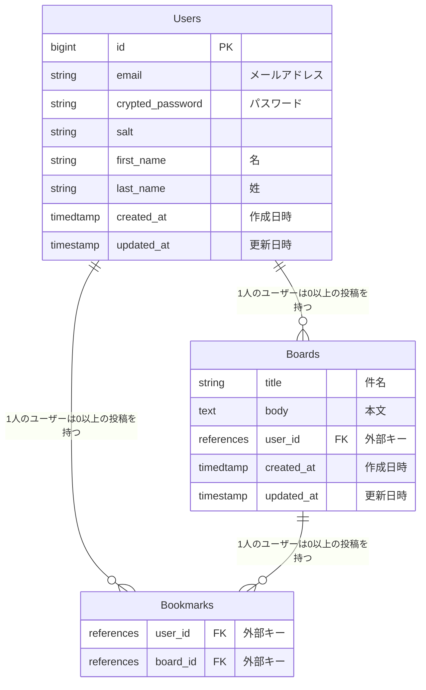

# ブックマーク機能の追加

## 概要
掲示板一覧画面で他者が投稿した掲示板をブックマーク登録や解除ができる機能を実装してください。ブックマークしている状態を★、ブックマークされていない状態を☆で表現してください。

また、ブックマークした掲示板の一覧を、ヘッダーの「ブックマーク一覧」にアクセスした際に確認できるように実装してください。

## アソシエーションを定義することで利用可能になるメソッド
### has_manyで追加されるメソッド
モデルにhas_manyを定義することで以下のメソッドが自動的に利用できるようになります。xxxxsの部分はプレイスホルダーで、has_many :posts とアソシエーションを定義していたら、プレイスホルダ―部分は posts になります。
（以下に記載するものはhas_manyを定義することで利用できるようになるメソッドの一部です）xxxxs
* xxxxs << object
* xxxxs.delete(object)
* xxxxs.destroy(object)
* xxxxs.empty?
* xxxxs.size
* xxxxs.find
* xxxxs.find_by
* xxxxs.where
etc
*  xxxxsメソッド
xxxxsメソッドは、モデルに定義された has_manyアソシエーション によって利用可能になるメソッドの一つです。xxxxsメソッドは、関連するオブジェクトの集合を返します。
例えば、Userモデルに has_many :posts と定義されている場合、user.posts でそのユーザーに関連する全ての投稿を取得します。
* xxxxs << object
xxxxs << objectは、指定されたオブジェクトを関連付けられたオブジェクトの集合に追加するためのメソッドです。
例えば、user.posts << post とすることで、特定の投稿をユーザーの投稿一覧に追加します。
* create_xxxx
create_xxxxメソッドは、関連付けられたオブジェクトを生成し、同時にデータベースに保存するためのメソッドです。
例えば、user.create_post(title: 'Title') とすることで、新しい投稿オブジェクトを生成し、データベースに保存します。このメソッドは、オブジェクトを一度に生成し、データベースに保存したい場合に使用されます。


## docker compose exec web rails g model Bookmark コマンドを実行
```ruby:app/model/bookmark.rb
class Bookmark < ApplicationRecord
  belongs_to :user
  belongs_to :board

/同じuser_idとboard_idの組み合わせが一意であることが保証される。つまり1人のユーザーが同じボードを複数回ブックマークすることを防ぐ
  validates :user_id, uniqueness: { scope: :board_id }
end
```
```ruby:db/migrate/_create_cookmarks.rb
class CreateBookmarks < ActiveRecord::Migration[7.0]
  def change
    create_table :bookmarks do |t|
      t.references :user, foreign_key: true
      t.references :board, foreign_key: true

      t.timestamps
    end
/user_idとboard_idの組み合わせに対してユニークインデックスを追加、1人のユーザーが同じボードを複数回ブックマークすることを防ぐ
    add_index :bookmarks, [:user_id, :board_id], unique: true
  end
end
```
```ruby:app/models/user.rb
class User < ApplicationRecord
  ... 省略 ...

  has_many :boards, dependent: :destroy
  has_many :comments, dependent: :destroy

/ユーザーが複数のブックマークを持つことを定義
  has_many :bookmarks, dependent: :destroy
/そのブックマークを通じて関連する掲示板を取得
  has_many :bookmark_boards, through: :bookmarks, source: :board

  ... 省略 ...
end
```
through: :bookmarks は、Bookmarkモデルを中間テーブルとして使用し、ブックマーク経由でBoardモデルにアクセスすることを示しています。さらに、source: :board は、Bookmarkモデルのどの属性を介してBoardモデルにアクセスするかを指定しています。この場合、Bookmarkモデルのboard属性を使用して関連するBoardオブジェクトを取得します。

これにより、ユーザーがブックマークした全ての掲示板を user.bookmark_boards というメソッドで簡単に取得できるようになります。

## ルーティングを定義
```ruby:config/routes.rb
Rails.application.routes.draw do
  ... 省略 ...
  resources :boards, only: %i[index new create show edit update destroy] do
    resources :comments, only: %i[create edit destroy], shallow: true
    collection do
      get :bookmarks
    end
  end
  resources :bookmarks, only: %i[create destroy]
  ... 省略 ...
end
```
* collection
  collectionは、resorces, resorceで作成されるRESTfulなルーティングにアクションを追加する際に使用します。RESTfulなルーティングにアクションを追加するものとしてmemberもありますが、memberは個々のリソースに対するアクション、collectionはリソース全体に対するアクションに使用します。

今回は、個々の掲示板（board）に対してプレビューを行いたいとかではなく、掲示板全体（boards）の中からブックマークされている掲示板の一覧を表示したいということで、collectionを使って get :bookmarks を記述しています。記述によって以下のルーティングが定義されます。

* prefix: bookmarks_boards
* HTTPメソッド: GET
* URLパターン: /boards/bookmarks
* コントローラー#アクション: boards#bookmarks
（/boards/bookmarks というURLからも「複数の掲示板のブックマーク一覧」という意味が読み取れます）

※今回はRESTfulなルーティングにアクションを追加することを学ぶことを主としていますが、安直にアクションを追加するのではなく、別のリソースが隠れていないかを考えて、RESTfulなルーティングを設定できないか考えましょう。

* resources :bookmarks,only: %[create destroy]
  resources :bookmarks, only: %i[create destroy] は、ブックマークの登録と解除のルーティングを定義しています。

この記述により、以下の2つのルートが生成されます：

* POST /bookmarks - ブックマークを新規作成するためのルート。これにより、ユーザーは指定した掲示板をブックマークに追加できます。このルートは、BookmarksControllerのcreateアクションに対応しています。
* DELETE /bookmarks/:id - ブックマークを削除するためのルート。これにより、ユーザーは特定のブックマークを解除できます。このルートは、BookmarksControllerのdestroyアクションに対応しています。
これらのルートを定義することで、ユーザーは簡単にブックマークの追加と削除を行えます。

## Userモデルにインスタンスメソッドを定義する
```ruby:app/model/user.rb
def bookmark(board)
  bookmark_boards << board
end

def unbookmark(board)
  bookmark_boards.destroy(board)
end

def bookmark?(board)
  bookmark_boards.include?(board)
end
```
* bookmark
bookmarkメソッドは、特定の掲示板をユーザーのブックマークに追加するためのメソッドです。このメソッドを使うと、ユーザーがその掲示板をお気に入りに登録できます。

メソッドの中でbookmark_boards << boardと書かれています。これは、ユーザーのブックマークリストに掲示板を追加する操作です。この操作を行うと、ユーザーと掲示板の間に「このユーザーがこの掲示板をブックマークした」という関係がデータベースに記録されます。

例えば、ある掲示板をブックマークしたい場合、current_user.bookmark(board)と呼び出します。これにより、その掲示板がユーザーのブックマークリストに追加され、データベースに保存されます。

* unbookmark
unbookmarkメソッドは、特定の掲示板をユーザーのブックマークから削除するためのメソッドです。このメソッドを呼び出すと、対象の掲示板がユーザーのbookmark_boardsコレクションから削除されます。

具体的には、current_user.unbookmark(board) のように使用します。この操作により、bookmarksテーブルから該当のレコードが削除され、ユーザーと掲示板の関係が解除されます。

* bookmark?
bookmark?メソッドは、特定の掲示板がユーザーのブックマークに含まれているかを確認するためのメソッドです。このメソッドを呼び出すと、対象の掲示板が bookmark_boards コレクションに存在するかどうかをチェックします。

メソッドの中で bookmark_boards.include?(board) と書かれています。これは、ユーザーのブックマークリストに特定の掲示板が含まれているかどうかをチェックする操作です。結果は true または false で返されます。

例えば、ユーザーが特定の掲示板をブックマークしているかどうかを確認する場合、current_user.bookmark?(board) と呼び出します。もしその掲示板がユーザーのブックマークリストに含まれていれば、このメソッドは true を返し、含まれていなければ false を返します。

## 星マークの出し分け
```ruby:app/views/boards/_bookmark_buttons.html.erb
<div class='ms-auto'>
  <% if current_user.bookmark?(board) %>
    <%= render 'unbookmark', { board: board } %>
  <% else %>
    <%= render 'bookmark', { board: board } %>
  <% end %>
</div>
```
current_user.bookmark?に個々のboardを渡すことで、ログインしているユーザーがブックマークしている掲示板か否かを判定して、tureであればif以下を、falseであればelse以下が実行されて星マークの出し分けを行っている

## ブックマーク一覧
```ruby:app/controllers/boards_controller.rb
def bookmarks
  @bookmark_boards = current_user.bookmark_boards.includes(:user).order(created_at: :desc)
end
```
* current_userがブックマークしたボードを取得する
  * current_user 現在ログイン中のユーザー王ジェクトを表す
* bookmark_boards
  * userモデルに関連つけられたブックマークされたボードのリレーション
* .includes(:user)
  * N+1クエリを防ぐために関連するuserデータを事前に読み込む
  * ここでのuserは各Boardがもつuser（ボードの作成者）を指します
  * あとで各ボードのuserデータを利用する際に追加のSQLクエリを発行するのを防ぎ、パフォーマンスが向上する
* .order(created_at: :desc)
  * ブックマークされたボードを作成日時（created_at）の降順（新しいものが先）で並び替えます。
* @bookmark_boards
  * 結果をインスタンス変数 @bookmark_boardsに格納、ビューや他のコードでアクセス可能になります

## アクションを定義
```ruby:app/controllers/bookmarks_controller.rb
class BookmarksController < ApplicationController
  def create
  
  /URLパラメーターから取得したboard_idを使って、Boardmモデルのデータベースを検索し、指定されたIDのボードを取得
  /（ex）params[:board_id] が1の場合、Board.find(1) が実行されます
    board = Board.find(params[:board_id])
    
  /current_user.bookmark(board)は、現在のユーザーがboardをブックマークする処理を呼び出す
  /bookmarkメソッドは、Userモデルに定義されたメソッドで、ユーザーがボードをブックマークするロジックを実行します（例えば、bookmarksテーブルに新しいレコードを作成するなど）。
    current_user.bookmark(board)

  /ユーザーをboards_path（ボード一覧ページ）にリダイレクトします。
    redirect_to boards_path, success: t('.success')
    end
  
  def destroy
  /current_user.bookmarksは、現在のユーザーが持っている全てのブックマークを指し、その中から指定されたidを検索して該当するBookmarkオブジェクトを取得します
  /.boardは、Bookmarkオブジェクトに関連付けられたBoardオブジェクトを取得します。つまり、ブックマークが設定されたボードを取得しています。
    board = current_user.bookmarks.find(params[:id]).board

  /unbookmarkメソッドは、Userモデルに定義されているメソッドで、指定されたboardのブックマークを解除するロジックを実行します（例えば、bookmarksテーブルからレコードを削除するなど）。
    current_user.unbookmark(board)

  /この行は、ユーザーを再度boards_path（ボード一覧ページ）にリダイレクトします。
  /status: :see_otherは、HTTPステータスコードを303 See Otherに設定します。これは、リダイレクトを示すコードで、ユーザーがリダイレクトされた後に再度フォーム送信などを行うことを防ぎます。
    redirect_to boards_path, success: t('.success'), status: :see_other
  end
end
```
