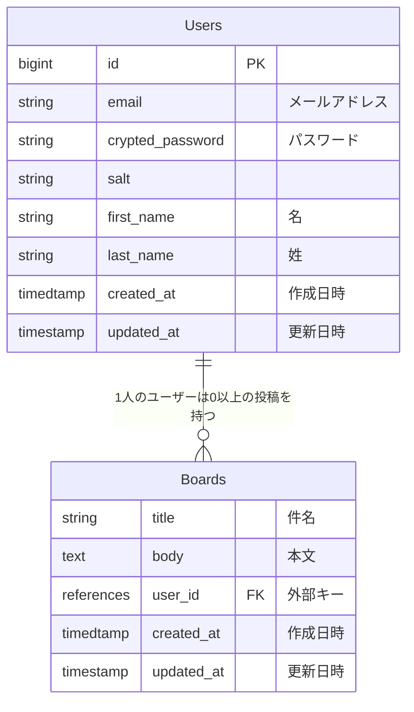

# 掲示板の一覧機能の作成
## 概要
* データベースのBoardsテーブルにレコードが無い場合は、「掲示板がありません」とページに表示すること。
* データベースのBoardsテーブルのレコード一覧を掲示板一覧として表示すること。
  * 表示するものは以下のとおり。
    * 掲示板のタイトル（title）
    * 掲示板の本文（body）
    * 掲示板を投稿したユーザーのフルネーム
    * 掲示板を投稿した日時（created_at）

* 上記に加えて以下の条件を満たしていること。
  * UsersテーブルとBoardsテーブルのリレーションは「1対多」にすること。
  * Boardの登録には誰が投稿したかが分かるように、外部キーにUser情報を含めること。
  * Boardに対して以下のバリデーションが機能すること。
    * titleカラムは255文字以下であること。
    * bodyカラムは65535文字以下であること。
  * 未ログイン状態で掲示板一覧画面にアクセスすると、ログインページにリダイレクトされること。
 
##　実装イメージ
```
- ■Boardモデル・Boardsテーブルを生成する
  - docker compose exec web rails g model Board コマンドを実行する
  - app/models/board.rbを編集する
  - マイグレーションファイルの編集する
  - データベースにマイグレーションファイルを適用する
- ■掲示版一覧画面へのルーティング設定する
  - config/routes.rbに resources :boards, only: %i[index] を記載する
- ■設定したルーティングに対応するコントローラーとアクションを用意する
  - docker compose exec web rails g controller boards コマンドを実行する
  - app/controllers/boards_controller.rbにindexアクションを定義する
- ■用意したコントローラーとアクションに対応するビューを用意する
  - app/views/boards/index.html.erbを生成・編集する
  - app/assets/images/配下にboard_placeholder.pngを配置する
  - app/views/boards/_board.html.erbを生成・編集する
- ■見た目・導線を整える
  - app/views/boards/index.html.erbを編集する
  - config/application.rbを編集する
  - config/locales/views/ja.ymlを編集する
  - app/controllers/application_controller.rbを編集する
  - app/controllers/user_sessions_controller.rbを編集する
- ■Boardレコードを用意する
  - RailsコンソールでBoardレコードを生成する
  - db/seeds.rbを用いてレコードを生成する
```



## Boardモデル・Boardsテーブルを生成する
```ruby:app/models/board.rb
class Board < ApplicationRecord
  validates :title, presence: true, length: { maximum: 255 }
  validates :body, presence: true, length: { maximum: 65_535 }

/BoardモデルがUserモデルに属していることを示す。Boardモデルの各レコードはUserモデルのレコードに関連つけられることになる
  belongs_to :user
end
```
```ruby:app/models/user.rb
class User < ApplicationRecord
  ... 省略 ...

/ユーザーが複数のBoardレコードを持つことを示す
  has_many :boards, dependent: :destroy
end
```
### アソシエーションとは
アソシエーションとは、Railsのモデル間の関連性を定義する機能です。これにより、異なるモデル同士がどのように結びついているかを簡単に表現できます。主なアソシエーションには、has_one、has_many、belongs_to があります。それぞれの使い方と概念を理解し、モデル間の関係を適切に設定しましょう。

#### has_one
has_oneアソシエーションは、1つのモデルが他のモデルと1対1で関連付けられる場合に使用します。例えば、ユーザーが1つのプロフィールを持つ場合、Userモデルに対してProfileモデルをhas_one :profile と定義します。これにより、Userモデルのインスタンスから関連づいたプロフィール情報を簡単に取得できます。

#### has_many
has_manyアソシエーションは、1つのモデルが複数の他のモデルと関連付けられる場合に使用します。例えば、ユーザーが複数の掲示板を持つ場合、Userモデルに対してBoardモデルを has_many :boards と定義します。これにより、Userモデルのインスタンスからそのユーザーが投稿した複数の掲示板情報を簡単に取得できます。

#### belongs_to
belongs_toアソシエーションは、1つのモデルが他のモデルに属する場合に使用します。例えば、掲示板がユーザーに属する場合、Boardモデルに対してUserモデルを belongs_to :user と定義します。これにより、Boardモデルのインスタンスから投稿者であるユーザー情報を簡単に取得できます。

## app/controllers/boards_controller.rbにindexアクションを定義する

```ruby:app/controllers/board_controller.rb
class BoardsController < ApplicationController
  def index

/includesメソッドは、Boradモデルのレコードと、それに関連するUserモデルのレコードを一度に取得する
    @boards = Board.includes(:user)
  end
end
```

## 用意したコントローラーとアクションに対応するビューを用意する
```ruby
 <div class="row">
    <div class="col-12">
      <div class="row">

/@boardsに値が存在するかどうか
        <% if @boards.present? %>
/@boardsに含まれる全てのオブジェクトをループ処理する
          <% @boards.each do |board| %>
            <div class="col-sm-12 col-lg-4 mb-3">
              <div id="board-id-<%= board.id %>">
                <div class="card">
                  <%= image_tag "board_placeholder.png", class: "card-img-top", width: "300", height:"200" %>
                  <div class="card-body">
                    <div class="d-flex">
                      <h4 class="card-title">
                        <%= link_to board.title, '#' %>
                      </h4>
                      <div class='ms-auto'>
                        <%= link_to '#', id: 'button-edit-#{board.id}' do %>
                          <i class="bi bi-pencil-fill"></i>
                        <% end %>
                        <%= link_to '#', id: 'button-delete-#{board.id}', method: :delete, data: {confirm: ''} do %>
                          <i class="bi bi-trash-fill"></i>
                        <% end %>
                      </div>
                    </div>
                    <ul class="list-inline">
                      <li><i class="bi bi-person"></i><%= board.user.decorate.full_name %></li>
                      <li><i class="bi bi-calendar"></i><%= l board.created_at, format: :short %></li>
                    </ul>
                    <p class="card-text">本文</p>
                  </div>
                </div>
              </div>
            </div>
          <% end %>
/値が無い場合に実行
        <% else %>
          <div class="mb-3">掲示板がありません</div>
        <% end %>
      </div>
    </div>
  </div>
```


* 掲示板を繰り返し表示する部分を切り出す
```ruby:app/views/boards/_board.html.erb
<div class="col-sm-12 col-lg-4 mb-3">
  <div id="board-id-<%= board.id %>">
    <div class="card">
      <%= image_tag "board_placeholder.png", class: "card-img-top", width: "300", height:"200" %>
      <div class="card-body">
        <div class="d-flex">
          <h4 class="card-title">
            <%= link_to board.title, '#' %>
          </h4>
          <div class='ms-auto'>
            <%= link_to '#', id: 'button-edit-#{board.id}' do %>
              <i class="bi bi-pencil-fill"></i>
            <% end %>
            <%= link_to '#', id: 'button-delete-#{board.id}', method: :delete, data: {confirm: ''} do %>
              <i class="bi bi-trash-fill"></i>
            <% end %>
          </div>
        </div>
        <ul class="list-inline">
          <li><i class="bi bi-person"></i><%= board.user.decorate.full_name %></li>
          <li><i class="bi bi-calendar"></i><%= l board.created_at, format: :short %></li>
        </ul>
        <p class="card-text">本文</p>
      </div>
    </div>
  </div>
</div>
```

```ruby:app/views/boards/index.html.erb
<div class="container pt-3">
  <div class="row">
    <div class="col-lg-10 offset-lg-1">
      <!-- 検索フォーム -->
      <form>
        <div class="input-group mb-3"><input class="form-control" placeholder="検索ワード" type="search"/>
          <div class="input-group-append"><input type="submit" value="検索" class="btn btn-primary"/></div>
        </div>
      </form>
    </div>
  </div>
  <!-- 掲示板一覧 -->
  <div class="row">
    <div class="col-12">
      <div class="row">
        <% if @boards.present? %>

/collectionオプションを使ったrenderメソッドの記述を、省略記法を使った記述
          <%= render @boards %>
        <% else %>
          <div class="mb-3">掲示板がありません</div>
        <% end %>
      </div>
    </div>
  </div>
</div>
```

* collectionオプションを使わずに記述した場合
```ruby
<% @boards.each do |board| %>
  <%= render 'board', locals: { board: board } %>
<% end %>
```
上記のコードは、@boardsに含まれる各Boardオブジェクトを用いて以下のループ処理を行っています。renderで呼び出しているapp/views/boards/_board.html.erb内で使用されているboard変数（{ board: board }の左側）に、各Boardオブジェクト（{ board: board }の右側）を渡しています。

* collectionオプションを使って記述した場合
```ruby
<%= render partial: 'board', collection: @boards %>
```
partialには呼び出す部分テンプレートのファイル名を指定し、collectionには繰り返し表示するデータを指定します。この場合、部分テンプレートに渡る変数名はpartialで指定した値（今回でいうとboard）になります。collectionオプションを使う場合は、partialを明示的に記載しないとエラーが出るので注意してください。

* collectionオプションを使った上で、省略記法を使って記述した場合
```ruby
<%= render @boards %>
```
collectionオプションを使ったrenderメソッドの記述は、特定の条件を満たした場合にのみ、下記のように省略して記述することができます。
* 部分テンプレートが呼び出し元のテンプレートと同じディレクトリ内にある
* 部分テンプレートのファイル名が指定した変数の単数形である
* 部分テンプレート内で使用する変数名が、オプションで指定した変数の単数形である
